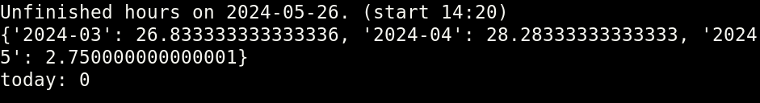
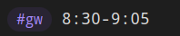

supports minute precision or just 10-11 is fine too or 9-9:30, etc. start the line with #tag (can set in script).

cant code rn fucked hands, these would be nice to add
- multiple tags, as param
- better way to set / autodetect dir?
- pure json output so can pipe
